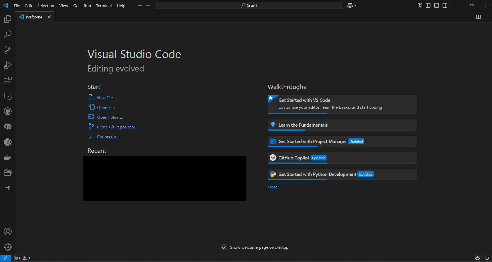
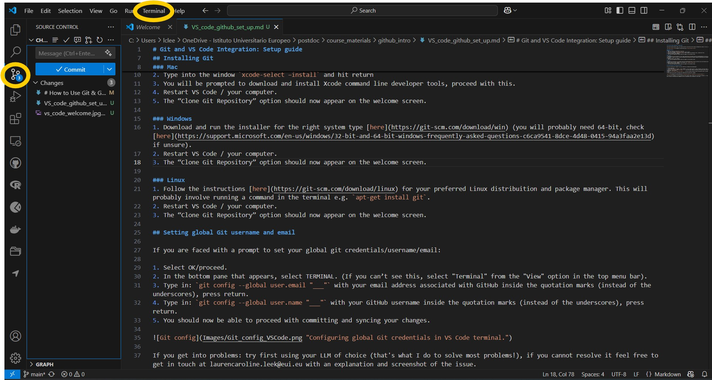
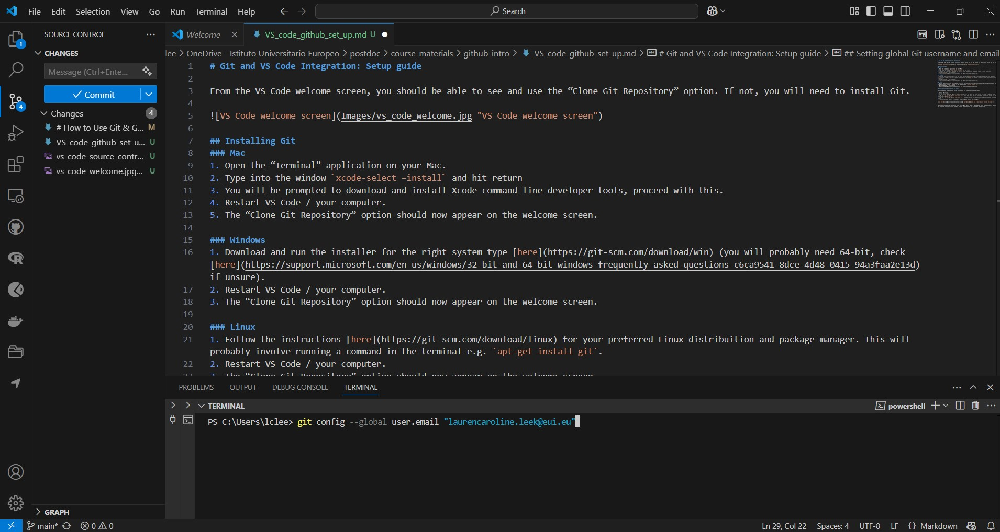

# Git and VS Code Integration: Setup guide

From the VS Code welcome screen, you should be able to see and use the “Clone Git Repository” option. If not, you will need to install Git.

## Installing Git
### Mac
1. Open the “Terminal” application on your Mac.
2. Type into the window `xcode-select –install` and hit return
3. You will be prompted to download and install Xcode command line developer tools, proceed with this.
4. Restart VS Code / your computer.
5. The “Clone Git Repository” option should now appear on the welcome screen.

### Windows
1. Download and run the installer for the right system type [here](https://git-scm.com/download/win) (you will probably need 64-bit, check [here](https://support.microsoft.com/en-us/windows/32-bit-and-64-bit-windows-frequently-asked-questions-c6ca9541-8dce-4d48-0415-94a3faa2e13d) if unsure).
2. Restart VS Code / your computer.
3. The “Clone Git Repository” option should now appear on the welcome screen.

### Linux
1. Follow the instructions [here](https://git-scm.com/download/linux) for your preferred Linux distribuition and package manager. This will probably involve running a command in the terminal e.g. `apt-get install git`.
2. Restart VS Code / your computer.
3. The “Clone Git Repository” option should now appear on the welcome screen.

## Setting global Git username and email

If you are faced with a prompt to set your global git credentials/username/email:

1. Select OK/proceed.
2. In the bottom pane that appears, select TERMINAL. (If you can’t see this, select "Terminal" from the "View" option in the top menu bar).
3. Type in: `git config --global user.email "___"` with your email address associated with GitHub inside the quotation marks (instead of the underscores), press return.
4. Type in: `git config --global user.name "___"` with your GitHub username inside the quotation marks (instead of the underscores), press return.
5. You should now be able to proceed with committing and syncing your changes.

If you get into problems: try first using your LLM of choice (that's what I do to solve most problems!), if you cannot resolve it feel free to get in touch at laurencaroline.leek@eui.eu with an explanation and screenshot of the issue.