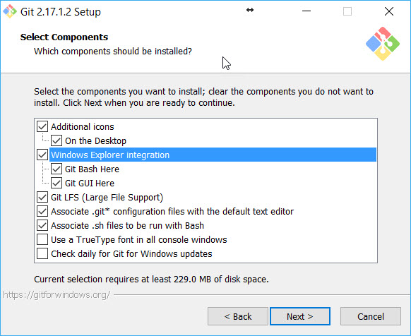
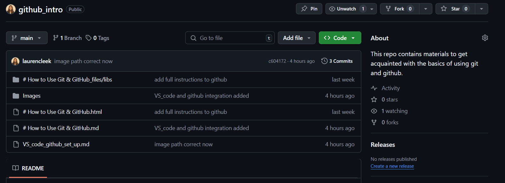
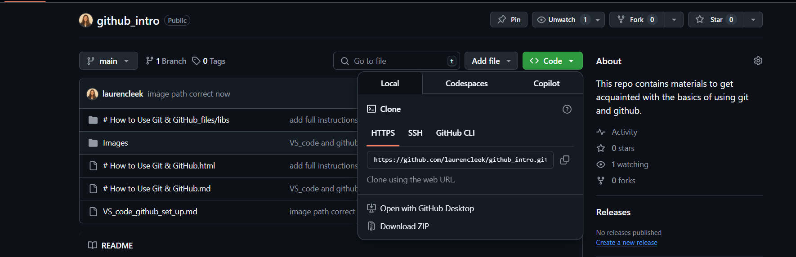
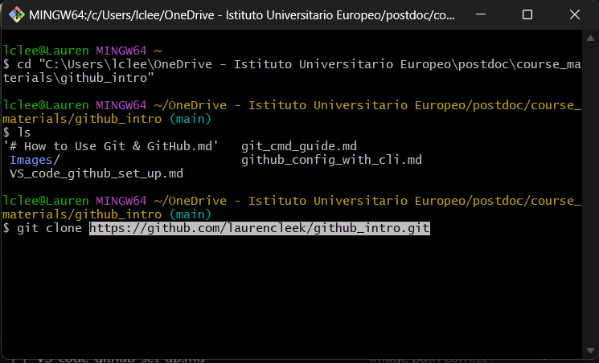
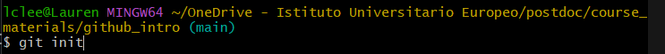
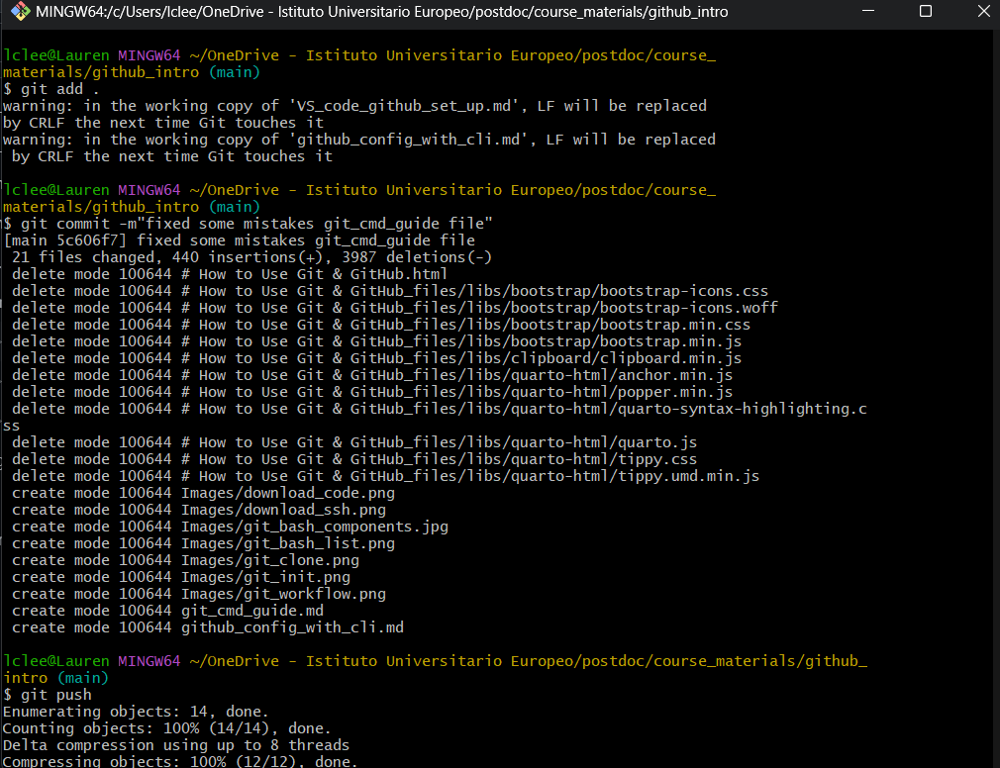

# Three Ways to Use GitHub: Command Line
This document lays out the main ways that GitHub can be used.

This guide covers everything you need to know to interact with GitHub. The topics covered in this document are:

1. Command Line / Terminal: Intro and Syntax
2. Cloning a existing repository
3. Working from your local (personal) computer
4. Creating a repo on GitHub
5. Working with branches (Advanced Difficulty)

## 1. Command Line
The very first thing you need to do if you are using GitHub from the command (cmd) line is to install Git. Even if it’s already installed, it’s probably a good idea to update to the latest version. The link below 
ains all the information you need to install Git on Windows, Mac, and Linux.

Install Git: https://git-scm.com/book/en/v2/Getting-Started-Installing-Git

**TIP:** When the Git installer prompts you "Select Components", ensure that *Windows Explorer Integration* is selected, along with Git Bash Here and Git GUI Here. This will allow you to use the context menu to open Git Bash in a specific location, without having to navigate to the directory your repository is in every time.



Windows Explorer Intergration is selected by default, so don't panic if you have already installed Git! If you un-selected this option, or it is not appearing on your context menu, the simpliest solution is to re-download and re-install Git making sure this option is selected. 

Note: Git for Windows comes with its own command prompt (Git Bash) that, besides git commands, has some useful Unix commands (and it looks better than the Windows default prompt).

**Make sure you have setup a GitHub account before advancing to the next stage of this walkthrough**

The general workflow of GitHub is represented in the diagram below. The black arrows are the commands that can be directly inputted into a console


For instructions on commit messages, refer to *Commit_Message_Guidelines.md*

If you are having trouble installing git on Mac visit this website: https://git-scm.com/download/mac

```
# First try running the command below in terminal
$ brew install git

# If this does not work, try running the command below in your terminal.
# If you a prompted for a password, enter the password you use to log into you account (no password will appear on screen)
# Press enter (return) when you have entered your password, and again when prompted by the intaller.
$ /bin/bash -c "$(curl -fsSL https://raw.githubusercontent.com/Homebrew/install/master/install.sh)"

# Once the install has finished, trying running the git install command again (below).
$ brew install git
```

### Introduction to Command Line
To use Git we'll be using the terminal/command line. If you’re not familiar with using the cmd line, some basic commands for navigating the file system are below. 

```
#  Use “cd” to change your current directory to the destination specified within the command.

# You can navigate directly to the sub-directory. My sub-directory is called "GitHub_SDS" which stands for Social Data Science.
cd Users\laurenleek\Documents\github_intro

# If your file path has a space in it, wrap the file path in quotes.
cd "C:\Users\laurenleek\Documents\github intro"
```
Another command that you may find in need is mkdir. This command creates a new directory with the specified name. The following command, for example, will create a new directory named *github_notes*.
```
# Create a file using "mkdir"
mkdir github_notes

# Create multiple folders at once
mkdir github_notes github_lecture_notes
```
One of the most frequent commands is List Directory or known as ls. With this command, you can list the content of a directory (folder).  
You can also retrieve the details of the listed content such as the directory date (created), directory permission, and the directory owners. To do so, type ls -l or simply ll.

> Listing directory using Git Bash on Windows


The ls command, however, will only work in a UNIX shell. You can run ls command in Ubuntu and Mac, but not in Windows. In Windows, type dir command instead.
The link to install Git at the start of this document includes **Git Bash**. Git Bash is an application for Microsoft Windows environments which provides an emulation layer (Bash - Unix Shell) for a Git command line.

Use the "touch" command to create an empty file. For example:

```
# Create a empty html file
touch notes_empty.html

# You can specify more filenames, as follows, to create multiple files at once.
touch notes_empty.html lecture_notes_empty.txt
```

### Command Line Syntax

In working with the command line (terminal) there are few important things that you need to know. In this guide each new line designates a *command line* that should be entered in the terminal. New lines are also sometimes designated with a chevron (>) or dollar sign ($). Exactly how this is written will depend on the guide you are looking at and the operating system you are working with.
```
> This is one line of code
> This is a second
This is a third
$ This is a fourth
```
After each command line you need to press Enter (or Return) in order to execute it.
On the command line (terminal) on your machine, the text before the $ or > is the user, Computer Name (after @) and (often) the directory that you are currently working in. The commands are typed after the > or $. In the example below laurenleek is the user and github_intro is the folder. Notice that slashes go in different directions in Windows, **but not in a Git Bash shell**.
```
# Windows
C:\Users\laurenleek\Documents\github_intro>

# Mac
laurenleek-MacBook-Pro: ~Documents/github_intro$

# Bash Shell (MING64 stands for Minimalist GNU for Windows)
laurenleek@Lauren MING64 ~/laurenleek/Documents/github_intro$
```
You will encounter errors if you use folder names with spaces in them as this will be read as two separate arguments in the command line. If you have spaces in you folder name, you can rename the folder/file in the usual way (i.e. using file explorer) or you can wrap the file name in quotation marks or inverted commas in the specified directory.
```
# This won’t work
cd users/lauren brooleekke/programs

# This will work
cd "user/lauren leek/programs"
```
When using git from the command line, you also need to start each command with the word “git” so the computer knows it is meant to be using git. Just putting “pull” or “push” etc. will result in an error

``` bash
git pull
git status
git clone
```

### Configuring Git
**Read: Telling git/GitHub who you are**

When you start working with git on the command line, you might recive the message "\*\*\*Please tell me who you are.". This slightly odd message is just git asking for your GitHub credentials so that you can login and uploaded (push) changes to the right location, with the appropiate permissions. **If you run the commands below, you will only need to configure the details for git once.**

``` bash
git config --global user.email "insert your GitHub email here"
git config --global user.name "insert you GitHub user name here"

# So for me, this would look like:
git config --global user.email laurencaroline.leek@eui.eu
git config --global user.name laurencleek
```
**Remember if there are spaces in your username you need to wrap it in speech marks**. SO if my user name was *Lauren Leek* I was need to write the user.name as detailed below, other wise each word will be understoond by git as seperate arguements.

``` bash
git config --global user.email laurencaroline.leek@eui.eu
git config --global user.name "Lauren Leek"
```


## 2. Cloning a Existing Repository
**Read: Downloading Github Repo to my Computer**

Cloning a repository pulls down a full copy of all the repository data that GitHub has at that point in time, including all versions of every file and folder for the project. At any point, you can push your changes to the remote repository on GitHub, or pull other people's changes from GitHub. For more information, see "Working From Your Local Computer" below.

On GitHub, navigate to the main page of the repository. 

Above the list of files, click "⬇️ Code".



To clone the repository using HTTPS, under "Clone with HTTPS", click 📋. To clone the repository using an SSH key, including a certificate issued by your organization's SSH certificate authority, click **Use SSH**, then click 📋.



Open Git Bash and change the current working directory to the location where you want the cloned directory (**cd**).

Type **git clone**, and then paste the URL you copied earlier. Then press Enter to create your local clone.



These files should now be copied to your local directory (folder).

## 3. Working From Your Local (Personal) Computer
### Creating a Repo
When creating a new project on your local machine using git, you'll first create a new repository (repo). *This is different to copying a exisiting project to your machine, which we will go through later.*
 
To begin, open up a terminal and move to where you want to place the project on your local machine using the cd (change directory) command detailed above.

To initialize a git repository in the root of the folder, run the **git init** command.

> Git init using the cmd line


### Add a New File to the Repo

You can open the terminal (command line) and navigate to the directory you want to push to GitHub using the **cd** command we explored in the first section. 

Once your in the correct location you are ready to push this changes to GitHub.

Once you've added or modified files in a folder containing a git repo, git will notice that changes have been made inside the repo. But, git won't officially keep track of the file (that is, put it in a commit - we'll talk more about commits next) unless you explicitly tell it to.

After creating the new file, you can use the git status command to see which files git knows exist.

What this basically says is, "Hey, we noticed you created a new file called hello_world.txt, but unless you use the 'git add' command we aren't going to do anything with it."

### Git Commits and Staging
One of the most confusing parts when you're first learning git is the concept of the staging environment and how it relates to a commit.

A commit is a record of what files you have changed since the last time you made a commit. Essentially, you make changes to your repo (for example, adding a file or modifying one) and then tell git to put those files into a commit.

**Commits make up the essence of your project and allow you to go back to the state of a project at any point.**

So, how do you tell git which files to put into a commit? This is where the staging environment or index come in. As seen above, when you make changes to your repo, git notices that a file has changed but won't do anything with it (like adding it in a commit).

To add a file to a commit, you first need to add it to the staging environment. To do this, you can use the git add <filename> command (see below).

Once you've used the git add command to add all the files you want to the staging environment, you can then tell git to package them into a commit using the git commit command. 


### Add a File to the Staging Environment
Add a file to the staging environment using the "git add" command. 

If you rerun the git status command, you'll see that git has added the file to the staging environment (notice the "Changes to be committed" line).  

**To commit all files use "git add ."**

### Create a Commit
It's time to create your first commit! Run the command: git commit -m "Your message about the commit"

The message at the end of the commit should be something related to what the commit contains - maybe it's a new feature, maybe it's a bug fix, maybe it's just fixing a typo. 

### Pushing to GitHub

Once you have commited your changede you are ready to **Push** all of your changes to GitHub! Note that if you have followed the steps above you do not need to repeat the commands, you only need to type **git push** and press enter.

```bash
cd Path/to/directory
git add .
git commit -m 'Submitting assignment'
git push
```
> Adding, commiting and pushing a file



After the push command, you should see a message that says "Everything up to date" or "Pushed to origin". This means that your changes have been successfully pushed to GitHub.
You can also open your GitHub repo in a web browser and see the changes you made.


## 4. Creating a New Repo on GitHub

If you only want to keep track of your code locally, you don't need to use GitHub. But if you want to work with a team, you can use GitHub to collaboratively modify the project's code.

To create a new repo on GitHub, log in and go to the GitHub home page. You should see a green "+" and then click "New repository" button.


When you're done filling out the information, press the "Create repository" button to make your new repo.

GitHub will ask if you want to create a new repo from scratch or if you want to add a repo you have created locally. In this case, since we've already created a new repo locally, we want to push that onto GitHub so follow the "....or push an existing repository from the command line" section.
