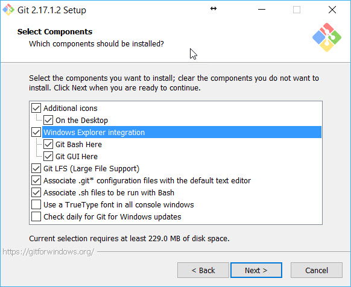
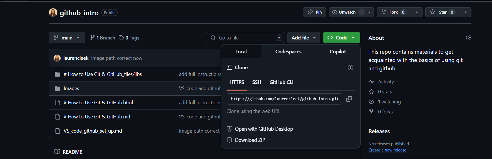
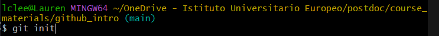
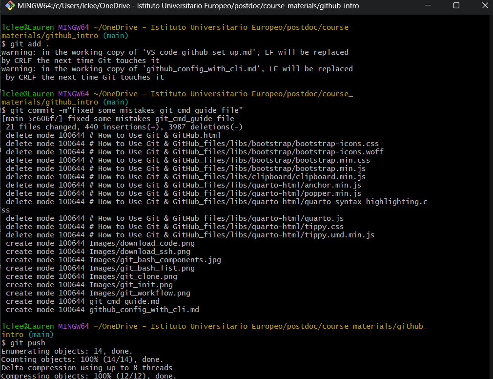
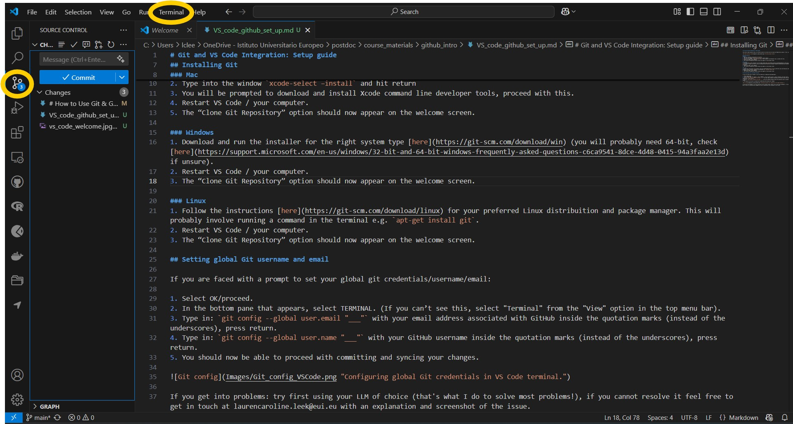

# How to Use Git & GitHub

This guide provides a concise overview of using Git and GitHub for version control, based on the essential steps and concepts introduced in the course materials .

---

## What is Version Control?
Version control systems (VCS) track changes in files over time, letting you:
- See who made which changes.
- Revert to earlier versions if needed.
- Collaborate seamlessly with others.

Git is a *distributed* VCS, meaning each collaborator’s machine has the full repository history. GitHub is a popular online service for hosting Git repositories and facilitating collaboration.

---

## A practical guide
Below is a practical guide to using Git and GitHub. It is divided into three sections:
1. **Command Line**: Basic commands and setup for Git and GitHub. 
2. **VS Code**: Integrating Git with Visual Studio Code for a more user-friendly experience.

## 1. Command Line

### Introduction to Command Line

To use Git we'll be using the terminal/command line. If you’re not familiar with using the cmd line, some basic commands for navigating the file system are below. 

```
#  Use “cd” to change your current directory to the destination specified within the command.

# You can navigate directly to the sub-directory. My sub-directory is called "github_intro".

cd Users\laurenleek\Documents\github_intro

# If your file path has a space in it, wrap the file path in quotes.
cd "C:\Users\laurenleek\Documents\github intro"
```
Another command that you may find in need is mkdir. This command creates a new directory with the specified name. The following command, for example, will create a new directory named *github_notes*.
```
# Create a file using "mkdir"
mkdir github_notes

# Create multiple folders at once
mkdir github_notes github_lecture_notes
```
One of the most frequent commands is List Directory or known as ls. With this command, you can list the content of a directory (folder).  
You can also retrieve the details of the listed content such as the directory date (created), directory permission, and the directory owners. To do so, type ls -l or simply ll.

> Listing directory using Git Bash on Windows


The ls command, however, will only work in a UNIX shell. You can run ls command in Ubuntu and Mac, but not in Windows. In Windows, type dir command instead.
The link to install Git at the start of this document includes **Git Bash**. Git Bash is an application for Microsoft Windows environments which provides an emulation layer (Bash - Unix Shell) for a Git command line.

Use the "touch" command to create an empty file. For example:

```
# Create a empty html file
touch notes_empty.html

# You can specify more filenames, as follows, to create multiple files at once.
touch notes_empty.html lecture_notes_empty.txt
```

### Command Line Syntax

In working with the command line (terminal) there are few important things that you need to know. In this guide each new line designates a *command line* that should be entered in the terminal. New lines are also sometimes designated with a chevron (>) or dollar sign ($). Exactly how this is written will depend on the guide you are looking at and the operating system you are working with.
```
> This is one line of code
> This is a second
This is a third
$ This is a fourth
```
After each command line you need to press Enter (or Return) in order to execute it.
On the command line (terminal) on your machine, the text before the $ or > is the user, Computer Name (after @) and (often) the directory that you are currently working in. The commands are typed after the > or $. In the example below laurenleek is the user and github_intro is the folder. Notice that slashes go in different directions in Windows, **but not in a Git Bash shell**.

```
You will encounter errors if you use folder names with spaces in them as this will be read as two separate arguments in the command line. If you have spaces in you folder name, you can rename the folder/file in the usual way (i.e. using file explorer) or you can wrap the file name in quotation marks or inverted commas in the specified directory.

```

### Installing Git
The very first thing you need to do if you are using GitHub from the command (cmd) line is to install Git. Even if it’s already installed, it’s probably a good idea to update to the latest version. The link below 
ains all the information you need to install Git on Windows, Mac, and Linux.

Install Git: https://git-scm.com/book/en/v2/Getting-Started-Installing-Git

Or more specific, check out: 

1. **macOS**  
   - Open your Terminal and type `git`. macOS will typically prompt you to install developer tools if Git isn’t already installed.  
   - Alternatively, download from: [git-scm.com/download/mac](https://git-scm.com/download/mac)

2. **Windows**  
   - Download Git from: [git-scm.com/download/win](https://git-scm.com/download/win)  
   - Or install the [GitHub Desktop](https://desktop.github.com/) application, which includes Git automatically.

3. **Create a GitHub Account**  
   - Sign up at [https://github.com/](https://github.com/).  
   - (Optional) Request student benefits: [https://education.github.com/benefits?type=student](https://education.github.com/benefits?type=student)

**TIP:** When the Git installer prompts you "Select Components", ensure that *Windows Explorer Integration* is selected, along with Git Bash Here and Git GUI Here. This will allow you to use the context menu to open Git Bash in a specific location, without having to navigate to the directory your repository is in every time.



Windows Explorer Intergration is selected by default, so don't panic if you have already installed Git! If you un-selected this option, or it is not appearing on your context menu, the simpliest solution is to re-download and re-install Git making sure this option is selected. 

Note: Git for Windows comes with its own command prompt (Git Bash) that, besides git commands, has some useful Unix commands (and it looks better than the Windows default prompt).

---


The general workflow of GitHub is represented in the diagram below. The black arrows are the commands that can be directly inputted into a console


When using git from the command line, you also need to start each command with the word “git” so the computer knows it is meant to be using git. Just putting “pull” or “push” etc. will result in an error

``` bash
git pull
git status
git clone
```


## Creating Your First Repository

1. Log in to your GitHub account and click on your user icon in the top-right corner.  
2. Navigate to **Your repositories** → **New**.  
3. Choose a **name** (e.g., `firstrepo`).  
4. Select **Private** if you want it to be accessible only to you (and those you share access with).  
5. Choose **Add a README file** and select an appropriate `.gitignore` template (for example, “R” if you are storing R code).  
6. Click **Create repository**.

Your repository now exists on GitHub.

---

## Configuring Git Locally

Open a terminal (macOS) or Git Bash (Windows), then:

```bash
# Set your username (replace with your real name)
git config --global user.name "Your Name"

# Set your email address (use the one associated with your GitHub account)
git config --global user.email "your@email.com"
```
Then navigate to the folder where you would like to locate the
repository on your computer with cd (change directory)


## 2. Cloning a Existing Repository

Cloning a repository pulls down a full copy of all the repository data that GitHub has at that point in time, including all versions of every file and folder for the project. At any point, you can push your changes to the remote repository on GitHub, or pull other people's changes from GitHub. For more information, see "Working From Your Local Computer" below.

On GitHub, navigate to the main page of the repository. 

Above the list of files, click "⬇️ Code".


To clone the repository using HTTPS, under "Clone with HTTPS", click 📋. To clone the repository using an SSH key, including a certificate issued by your organization's SSH certificate authority, click **Use SSH**, then click 📋.



Open Git Bash and change the current working directory to the location where you want the cloned directory (**cd**).

Type **git clone**, and then paste the URL you copied earlier. Then press Enter to create your local clone.


These files should now be copied to your local directory (folder).

The next step is to copy (clone) the online repository to your computer:

1. On your repository page on GitHub:
   - Click on the green "Code" button
   - Copy the HTTPS URL

2. In the command line, enter:
   ```bash
   git clone <URL>
   ```
   (Replace `<URL>` with the copied repository URL)

3. Authentication:
   - You will be prompted for your GitHub username and password
   - Note: For password authentication, you'll need to create a personal access token
   - Some users may instead get a popup window for authentication - in this case you can skip creating an access token

   To create a personal access token:
   1. On GitHub, click on your profile icon in the upper right corner
   2. Go to Settings → Developer settings → Personal access tokens → Generate new token
   3. Configure the token:
      - Give it a descriptive name (e.g. "command line") 
      - Choose an expiration date
      - Select "repo" scope (allows access to private and public repositories)
      - Click "Generate token"
   4. Copy the generated token immediately (it will only be shown once)
   5. Return to the command line:
      - Enter your GitHub username
      - Use the token as your password when prompted
   
   Once authenticated, your Git and GitHub setup is complete and the repository will be cloned locally. You won't need to authenticate again until the token expires.

## 3. Working From Your Local (Personal) Computer
### Creating a Repo
When creating a new project on your local machine using git, you'll first create a new repository (repo). *This is different to copying a exisiting project to your machine, which we will go through later.*
 
To begin, open up a terminal and move to where you want to place the project on your local machine using the cd (change directory) command detailed above.

To initialize a git repository in the root of the folder, run the **git init** command.

> Git init using the cmd line


### Add a New File to the Repo

You can open the terminal (command line) and navigate to the directory you want to push to GitHub using the **cd** command we explored in the first section. 

Once your in the correct location you are ready to push this changes to GitHub.

Once you've added or modified files in a folder containing a git repo, git will notice that changes have been made inside the repo. But, git won't officially keep track of the file (that is, put it in a commit - we'll talk more about commits next) unless you explicitly tell it to.

After creating the new file, you can use the git status command to see which files git knows exist.

What this basically says is, "Hey, we noticed you created a new file called hello_world.txt, but unless you use the 'git add' command we aren't going to do anything with it."

### Git Commits and Staging
One of the most confusing parts when you're first learning git is the concept of the staging environment and how it relates to a commit.

A commit is a record of what files you have changed since the last time you made a commit. Essentially, you make changes to your repo (for example, adding a file or modifying one) and then tell git to put those files into a commit.

**Commits make up the essence of your project and allow you to go back to the state of a project at any point.**

So, how do you tell git which files to put into a commit? This is where the staging environment or index come in. As seen above, when you make changes to your repo, git notices that a file has changed but won't do anything with it (like adding it in a commit).

To add a file to a commit, you first need to add it to the staging environment. To do this, you can use the git add <filename> command (see below).

Once you've used the git add command to add all the files you want to the staging environment, you can then tell git to package them into a commit using the git commit command. 


### Add a File to the Staging Environment
Add a file to the staging environment using the "git add" command. 

If you rerun the git status command, you'll see that git has added the file to the staging environment (notice the "Changes to be committed" line).  

**To commit all files use "git add ."**

### Create a Commit
It's time to create your first commit! Run the command: git commit -m "Your message about the commit"

The message at the end of the commit should be something related to what the commit contains - maybe it's a new feature, maybe it's a bug fix, maybe it's just fixing a typo. 

### Pushing to GitHub

Once you have commited your changede you are ready to **Push** all of your changes to GitHub! Note that if you have followed the steps above you do not need to repeat the commands, you only need to type **git push** and press enter.

```bash
cd Path/to/directory
git add .
git commit -m 'Submitting assignment'
git push
```
> Adding, commiting and pushing a file



After the push command, you should see a message that says "Everything up to date" or "Pushed to origin". This means that your changes have been successfully pushed to GitHub.
You can also open your GitHub repo in a web browser and see the changes you made.


## 4. Creating a New Repo on GitHub

If you only want to keep track of your code locally, you don't need to use GitHub. But if you want to work with a team, you can use GitHub to collaboratively modify the project's code.

To create a new repo on GitHub, log in and go to the GitHub home page. You should see a green "+" and then click "New repository" button.


When you're done filling out the information, press the "Create repository" button to make your new repo.

GitHub will ask if you want to create a new repo from scratch or if you want to add a repo you have created locally. In this case, since we've already created a new repo locally, we want to push that onto GitHub so follow the "....or push an existing repository from the command line" section.


## Creating a file

1. We will now create a new file in the repository and log these changes

2. Create a new file:
   - Using RStudio or a text editor (e.g. VS Code - download at https://code.visualstudio.com/)
   - Add a file called `somecode.R` into the repository folder

3. Navigate to the repository:
   ```bash
   cd firstrepo
   ```

4. You are now ready to commit the changes made to the repository

## Committing changes

1. Check for changes:
   ```bash
   git status
   ```
   Make sure you are in the repository folder on your computer

2. Add changes to staging area:
   ```bash
   git add .
   ```
   - You can also add specific files instead of using the dot
   - WARNING: Be very careful using the dot to add files!

3. Commit the changes:
   ```bash
   git commit -m "added a code sample"
   ```

4. View commit history:
   ```bash
   git log
   ```

To practice these steps:
1. Add another line of code to your file
2. Repeat the above process (status → add → commit)
3. Check the commit history again with `git log`

## Pushing changes to the remote repository

1. Store changes in the remote repository:
   ```bash
   git push
   ```

2. Review changes in GitHub:
   - Go to repository page on GitHub
   - Click clock symbol next to 'commits' in upper right
   - Click on commit hash (e.g. '472cb9d') to see code changes

3. Get latest changes:
   ```bash
   git pull
   ```
   Run this if others have updated the remote repository


## Additional Git/GitHub Concepts

### Forking
- Creates your own copy of someone else's repository on GitHub
- Changes you push only affect your fork, not the original repository
- Useful for contributing to open source projects
- Different from cloning which creates a local copy

### Branches
- Parallel versions of code that branch off from main codebase
- Allow development of features without affecting main code
- Create a new branch:
  ```bash
  git branch feature-name
  git checkout feature-name
  ```
- Or create and checkout in one command:
  ```bash 
  git checkout -b feature-name
  ```

### Merging
- Combines changes from different branches
- Merge a branch into current branch:
  ```bash
  git merge branch-name
  ```
- May need to resolve conflicts if same files changed in both branches

### Pull Requests
- GitHub feature to propose changes from your fork/branch
- Steps to create:
  1. Push changes to your fork/branch
  2. Go to original repo on GitHub
  3. Click "New Pull Request"
  4. Select branches to compare
  5. Add description of changes
  6. Submit pull request
- Repository maintainers can review, comment, and merge

### Review of Key Commands

| Command | Description |
|---------|-------------|
| `git clone ...` | Download online repository to local computer |
| `git status` | See status of files in repository |
| `git add .` | Stage all changes made (alternatively add distinct file names to be staged) |
| `git commit -m "some message"` | Commit (i.e. record) staged changes |
| `git push` | Upload local changes to remote repository |
| `git pull` | If files changed online, update local repository first |


# Git and VS Code Integration: Setup guide

From the VS Code welcome screen, you should be able to see and use the “Clone Git Repository” option. If not, you will need to install Git.


## Installing Git
### Mac
1. Open the “Terminal” application on your Mac.
2. Type into the window `xcode-select –install` and hit return
3. You will be prompted to download and install Xcode command line developer tools, proceed with this.
4. Restart VS Code / your computer.
5. The “Clone Git Repository” option should now appear on the welcome screen.

### Windows
1. Download and run the installer for the right system type [here](https://git-scm.com/download/win) (you will probably need 64-bit, check [here](https://support.microsoft.com/en-us/windows/32-bit-and-64-bit-windows-frequently-asked-questions-c6ca9541-8dce-4d48-0415-94a3faa2e13d) if unsure).
2. Restart VS Code / your computer.
3. The “Clone Git Repository” option should now appear on the welcome screen.

### Linux
1. Follow the instructions [here](https://git-scm.com/download/linux) for your preferred Linux distribuition and package manager. This will probably involve running a command in the terminal e.g. `apt-get install git`.
2. Restart VS Code / your computer.
3. The “Clone Git Repository” option should now appear on the welcome screen.

## Setting global Git username and email

If you are faced with a prompt to set your global git credentials/username/email:

1. Select OK/proceed.
2. In the bottom pane that appears, select TERMINAL. (If you can’t see this, select "Terminal" from the "View" option in the top menu bar).
3. Type in: `git config --global user.email "___"` with your email address associated with GitHub inside the quotation marks (instead of the underscores), press return.
4. Type in: `git config --global user.name "___"` with your GitHub username inside the quotation marks (instead of the underscores), press return.
5. You should now be able to proceed with committing and syncing your changes.




---
## Finally
If you get into problems: try first using your LLM of choice (that's what I do to solve most problems!), if you cannot resolve it feel free to get in touch at laurencaroline.leek@eui.eu with an explanation and screenshot of the issue.


Other resources:

https://zenodo.org/records/3369466

https://happygitwithr.com/

